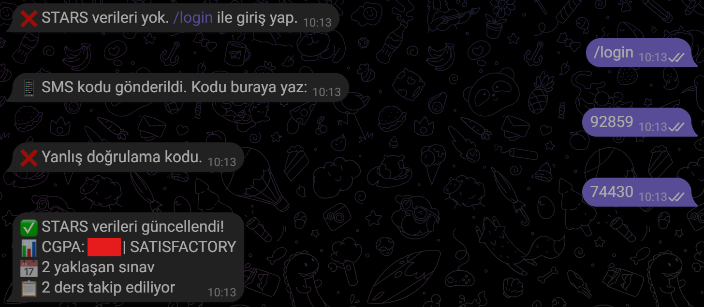
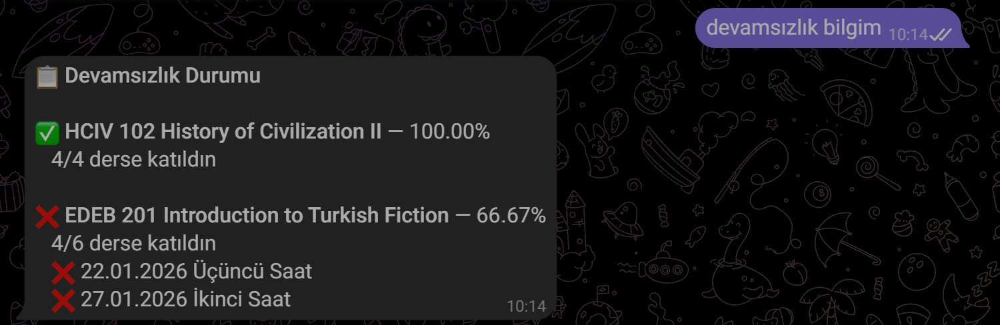

# Moodle Student Tracker


A **RAG-based personal academic assistant** for Bilkent University students. Indexes Moodle course materials, fetches STARS grades/attendance/exam data, monitors university emails. All served through a single Telegram bot.



## Architecture

```
┌──────────────────────────────────────────────────────────────────┐
│                        TELEGRAM BOT                              │
│                     (telegram_bot.py)                             │
│  Commands · Message Handler · Callback Handler · Background Jobs │
└───────────┬──────────┬──────────┬──────────┬─────────────────────┘
            │          │          │          │
   ┌────────▼───┐ ┌────▼────┐ ┌──▼───┐ ┌───▼────────┐
   │ LLM Engine │ │  Sync   │ │Vector│ │   Memory   │
   │  (RAG +    │ │ Engine  │ │Store │ │  (Hybrid)  │
   │  Prompts)  │ │         │ │FAISS │ │            │
   └──┬────┬────┘ └──┬──┬──┘ └──────┘ └────────────┘
      │    │         │  │
┌─────▼┐ ┌─▼───────┐│ ┌▼──────────────┐
│ LLM  │ │ Vector  ││ │   Document    │
│Provid│ │ Store   ││ │  Processor    │
│ ers  │ │         ││ │ PDF/DOCX/OCR  │
└──────┘ └─────────┘│ └───────────────┘
                    │
            ┌───────▼───────┐
            │ Moodle Client │
            │ (Web Services)│
            └───────────────┘

┌──────────────────────┐  ┌──────────────────────┐
│    STARS Client       │  │   Webmail Client      │
│  OAuth + SMS 2FA      │  │   IMAP (AIRS/DAIS)    │
│  Grades · Exams ·     │  │   Email monitoring     │
│  Attendance · GPA     │  │                        │
└──────────────────────┘  └──────────────────────┘
```




### Hexagonal Architecture (Ports & Adapters)

The application consists of three layers:

| Layer | Files | Role |
|-------|-------|------|
| **UI Adapters** | `telegram_bot.py`, `main.py` | User interfaces (Telegram, CLI) |
| **Core Logic** | `llm_engine.py`, `sync_engine.py`, `vector_store.py`, `memory.py` | Business logic, RAG, memory management |
| **External Adapters** | `moodle_client.py`, `stars_client.py`, `webmail_client.py`, `llm_providers.py` | External service integrations |

---

## Design Patterns

### Strategy Pattern
Different extraction strategies for different file types, common interface for different LLM providers:
```
DocumentProcessor._extract_pdf()  / _extract_docx() / _extract_pptx() / _extract_html()
MultiProviderEngine → GLM / OpenAI / Claude (all OpenAI-compatible)
```

### Repository Pattern
`VectorStore` and `DynamicMemoryDB` abstract data access. Chunk dedup, FAISS persistence, SQLite memory store:
```
VectorStore.add_chunks()  → deduplicate → encode → FAISS index → persist
VectorStore.query()       → encode query → cosine similarity → filter → return
DynamicMemoryDB           → SQLite (WAL mode) → token-budget ranking
```

### State Machine
STARS session management with explicitly defined states:
```
StarsSession._phase:  idle → awaiting_sms → ready
```

### Factory Pattern
Task-based LLM model selection:
```python
# .env routing:
MODEL_CHAT=glm-4.7          # Main chat
MODEL_EXTRACTION=gpt-4.1-nano  # Memory extraction
MODEL_SUMMARY=glm-4.7       # Weekly summary
```

### Chain of Responsibility
Sync pipeline in sequential stages:
```
Moodle API → Download → Extract (PDF/DOCX/OCR) → Chunk → Embed → FAISS Index
```

### Command Pattern
Each Telegram command has a separate handler function:
```
/menu → cmd_menu()    /sync → cmd_sync()    /odevler → cmd_odevler()
/stars → cmd_stars()   /mail → cmd_mail()    /login  → cmd_login()
```

### Observer (Job Queue)
Background tasks via python-telegram-bot job queue:
```
auto_sync_job       → 10 min  → Moodle synchronization
assignment_check    → 30 min  → New assignment detection
mail_check          → 5 min   → AIRS/DAIS email check
deadline_reminder   → Daily   → 3-day advance warning
keepalive (x2)      → 2 min   → Moodle + IMAP connection keep-alive
```

### Adapter Pattern
External APIs transformed into a common interface:
```
MoodleClient  → Moodle Web Services REST API
StarsClient   → OAuth 1.0 + HTML scraping (BeautifulSoup)
WebmailClient → IMAP4_SSL (mail.bilkent.edu.tr)
```

### Template Method
RAG chat flow follows the same template every time:
```
query → detect course → vector search (+ fallback) → memory inject → LLM call → save history
```

---

## Data Flow

### RAG Pipeline (User Query)

```
User Message
  │
  ├─→ Active course detection (name matching)
  │
  ├─→ VectorStore.query()
  │   ├─→ Sentence-transformers encode
  │   ├─→ FAISS cosine similarity (top 15)
  │   └─→ Course filter + fallback (all courses if filter is weak)
  │
  ├─→ HybridMemoryManager.build_memory_context()
  │   ├─→ Static: profile.md (~300-500 tokens)
  │   ├─→ Dynamic: SQLite selective fetch (~300-800 tokens)
  │   └─→ Weak topics + recent messages
  │
  ├─→ LLMEngine.chat_with_history()
  │   └─→ MultiProviderEngine.complete(task="chat")
  │       └─→ GLM-4.7 (or routed model)
  │
  ├─→ Memory update (LLM-based extraction)
  │   ├─→ Semantic memory → SQLite
  │   └─→ Topic mastery tracking
  │
  └─→ Send response to Telegram
```

### STARS Authentication Flow

```
GET /srs/ → 4 redirects → login page
  → POST credentials → verifySms page (SMS 2FA)
    → POST SMS code → oauth/authorize (Referer header is critical!)
      → srs/oauth-login.php?oauth_verifier=... → /srs/ (authenticated)
        → HTML parse: grades, exams, attendance, GPA
```

### Sync Pipeline (Background)

```
Moodle API → discover courses & files
  → Download to data/downloads/
    → DocumentProcessor (PDF/DOCX/PPTX/HTML + OCR fallback)
      → RecursiveCharacterTextSplitter (1000 char, 200 overlap)
        → sentence-transformers encode → FAISS add → persist
```

---

## Memory System

Two-layer hybrid architecture:

```
┌──────────────────────┐    ┌──────────────────────────┐
│   STATIC LAYER       │    │     DYNAMIC LAYER        │
│   (profile.md)       │    │     (SQLite DB)          │
│                      │    │                          │
│ Identity, prefs      │    │ Semantic memories        │
│ Course list          │    │ Learning progress        │
│ Study schedule       │    │ Conversation history     │
│                      │    │ Weak topic detection     │
│ Always in prompt     │    │ Query-time selective     │
│ ~300-500 tokens      │    │ ~300-800 tokens          │
│ Rarely updated       │    │ Updated every turn       │
└──────────────────────┘    └──────────────────────────┘

Total per-turn cost: ~600-1300 tokens (vs 4000-8000 full-context)
```

---

## Features

### Academic Assistant (RAG)
- Automatically indexes Moodle course materials (PDF, DOCX, PPTX, HTML)
- Context-aware answers with course-based filtering + fallback
- Tutor mode (5-step Socratic method)
- Quiz mode (5 questions + scoring + difficulty selection)
- Practice question generation
- Weekly course summary

### STARS Integration
- Automatic login via OAuth + SMS 2FA
- Grade viewing (per-course assessments)
- Exam schedule (days remaining info)
- Attendance tracking (percentage + details)
- Academic standing (CGPA + semester-based)
- Transcript (all semesters)

### Moodle Tracking
- Automatic synchronization (10-minute intervals)
- New assignment notifications
- Deadline reminders (3 days in advance)
- File upload + indexing (user-submitted PDF/DOCX)

### Email Monitoring
- AIRS (instructor) emails
- DAIS (department) emails
- New email notifications (5-minute intervals, with LLM summary)

### Memory & Personalization
- Learning progress tracking (topic mastery 0-1.0)
- Weak topic detection and review suggestions
- Conversation history (last 20 messages)
- Semantic memory (preferences, goals, challenges)

---

## File Structure

```
.
├── telegram_bot.py          # Main Telegram bot (handlers + jobs)
├── main.py                  # CLI interface (sync, chat, summary, web)
├── core/
│   ├── config.py            # Environment variable management
│   ├── moodle_client.py     # Moodle Web Services API client
│   ├── document_processor.py # PDF/DOCX/PPTX/HTML extraction + OCR
│   ├── vector_store.py      # FAISS vector store + dedup
│   ├── llm_engine.py        # RAG orchestration + custom prompts
│   ├── llm_providers.py     # Multi-provider LLM routing
│   ├── sync_engine.py       # Moodle → index pipeline
│   ├── memory.py            # Hybrid memory (static + dynamic)
│   ├── stars_client.py      # Bilkent STARS scraper
│   └── webmail_client.py    # IMAP email monitoring
├── data/
│   ├── downloads/           # Downloaded course files
│   ├── chromadb/            # FAISS index + metadata
│   ├── memory.db            # SQLite dynamic memory
│   ├── sync_state.json      # Sync state
│   └── .moodle_token        # Cached Moodle token
├── .env                     # Environment variables
├── .env.example             # Example configuration
└── requirements.txt         # Python dependencies
```

---

## Setup

### Requirements
- Python 3.11+
- Moodle 3.9+ (Web Services enabled)
- Tesseract OCR (for scanned PDFs)

### Steps

```bash
# 1. Install dependencies
pip install -r requirements.txt

# 2. Configure environment variables
cp .env.example .env
# Edit the .env file (Moodle, LLM API key, Telegram token)

# 3. Run with Telegram bot
python telegram_bot.py

# --- or with CLI ---

# Synchronization
python main.py sync

# Interactive chat
python main.py chat

# Web interface (Gradio)
python main.py web
```

### LLM API Keys

| Provider | Model | Usage | Env Variable |
|----------|-------|-------|-------------|
| Z.ai (GLM) | glm-4.7 | Chat, summary, questions | `GLM_API_KEY` |
| OpenAI | gpt-4.1-nano | Memory extraction, topic detection | `OPENAI_API_KEY` |

### Moodle Token

Obtained automatically (via `MOODLE_USERNAME` + `MOODLE_PASSWORD`) or manually:
```
https://MOODLE_URL/login/token.php?username=XXX&password=XXX&service=moodle_mobile_app
```

---

## Deployment

Production deployment with systemd:

```bash
# Copy files to server
scp telegram_bot.py root@server:/opt/moodle-bot/
scp -r core/ root@server:/opt/moodle-bot/core/

# Start the service
ssh root@server "systemctl restart moodle-bot"

# Check status
ssh root@server "systemctl status moodle-bot --no-pager"
```

---

## Tech Stack

| Layer | Technology |
|-------|------------|
| Bot Framework | python-telegram-bot 21+ |
| Embedding | sentence-transformers (all-MiniLM-L6-v2) |
| Vector DB | FAISS (IndexFlatIP, cosine similarity) |
| LLM | GLM-4.7 + GPT-4.1-nano (task-based routing) |
| Document Processing | PyPDF2, PyMuPDF, python-docx, BeautifulSoup |
| OCR | Tesseract (tur+eng, extended lang fallback) |
| Text Splitting | langchain RecursiveCharacterTextSplitter |
| Memory | SQLite (WAL mode) + Markdown profile |
| Web Scraping | requests + BeautifulSoup (STARS) |
| Email | imaplib (IMAP4_SSL) |
| Async | asyncio + asyncio.to_thread() |
