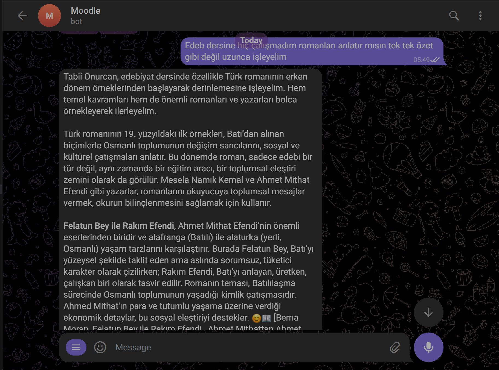
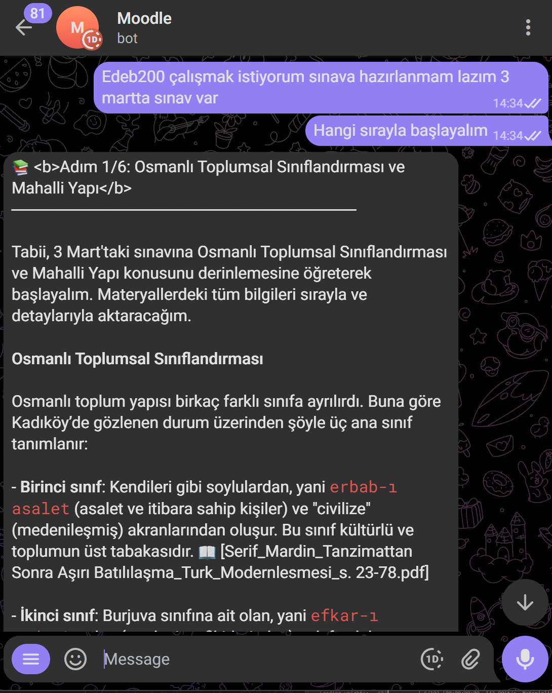
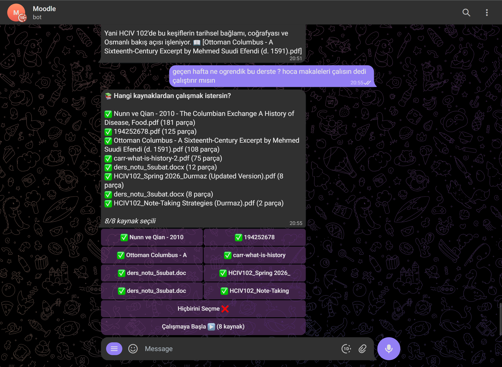
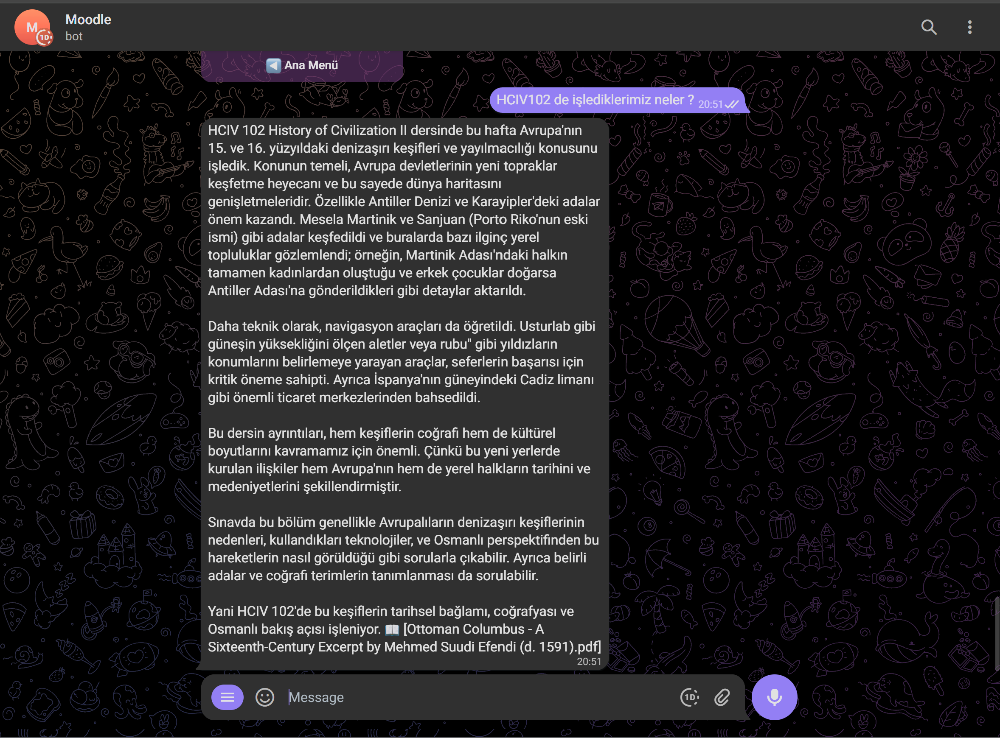
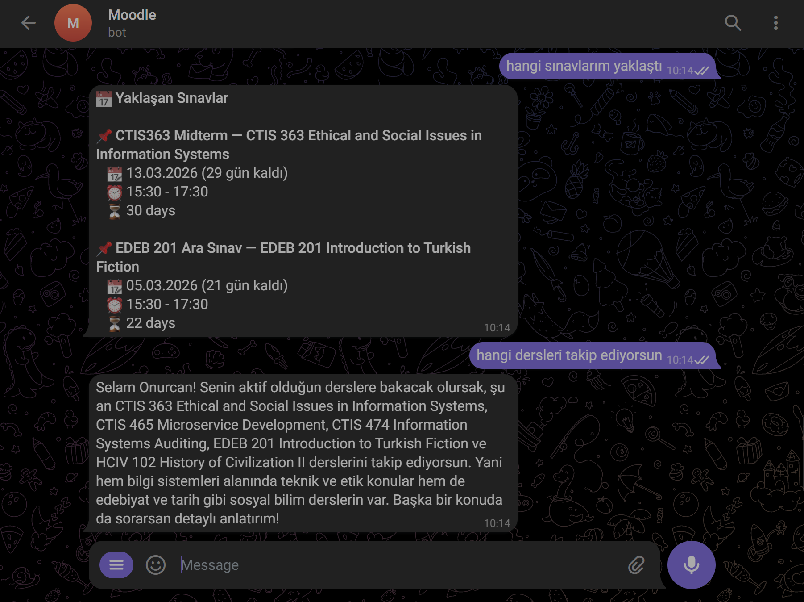
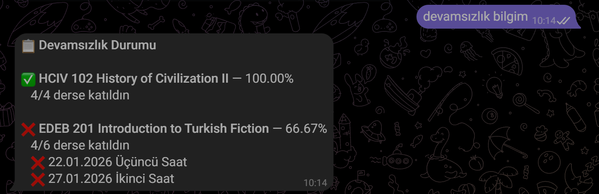
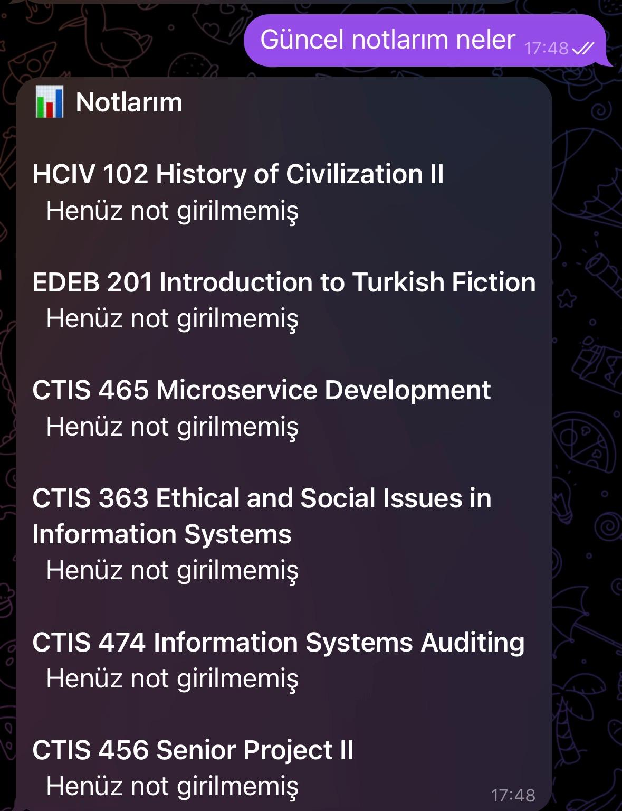
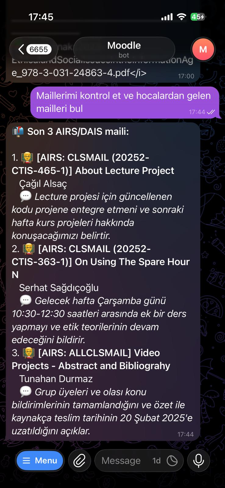

# Moodle Student Tracker


Bilkent ogrencisi icin **agentic AI asistan**. Moodle, STARS, webmail ve ders materyallerini tek Telegram botunda birlestirir. LLM, gercek zamanli cache'lenmis veriden okuyarak notlar, devamsizlik, sinavlar, yaklasan odevler ve ders materyalleri hakkinda sub-saniye yanit uretir; materyale dayali RAG ile pedagojik ogretim yapar.

---

## Aktif Ozellikler

### Akademik veri erisimi (LLM tool'lari)

- **Notlar** — `get_grades` (STARS cache)
- **Devamsizlik + syllabus limiti** — `get_attendance`, syllabus'tan max limit + kalan hak hesabi
- **Ders programi** — `get_schedule` (STARS)
- **Sinav takvimi** — `get_exams` (STARS + `exam_reminder` job'u 1h'de bir yaklasan sinavi bildirir)
- **Transkript + harf notu** — `get_transcript`, `get_letter_grades` (cache + live fallback)
- **Odevler** — `get_assignments`, upcoming/overdue/all filtreleri (Moodle cache)
- **Ders materyalleri** — `get_moodle_materials` (Moodle course topics cache)
- **Kurslar** — `list_courses`, `set_active_course`

### Egitim & RAG

- **Hybrid RAG** — FAISS (semantik) + BM25 (Snowball TR/EN stemming) → Reciprocal Rank Fusion (k=60)
- **Ders uzerinden ogretim** — `study_topic`, `rag_search`, `get_source_map`, `read_source`
- **Adaptive threshold** — `max(top_score * 0.60, 0.20)`, top 10 chunk
- **Multi-lang embedding** — `paraphrase-multilingual-MiniLM-L12-v2` (384 dim, 50+ dil)
- **Hybrid PDF extraction** — text page'ler pymupdf4llm, scanned page'ler direkt OCR

### Haberlesme

- **Webmail** — `get_emails`, `get_email_detail` (IMAP cache + subject/from/body substring search)
- **Auto bildirim** — yeni mail (30s cadence, cache-diff), yeni odev (10m cadence), deadline reminder (24h)
- **Mail ozeti** — LLM uzerinden hoca duyurusu ozetleme

### Sistem

- **Arka plan senkronizasyon** — 15 background job; STARS 1m, email 30s, assignments 10m, materials 30m
- **Session persistence** — STARS session'lari diske yazilir; restart sonrasi `keep_alive` ile dogrulama, SMS 2FA atlanir
- **Polling watchdog** — Telegram API probe (5m cadence); 30dk stuck detect ederek self-kill → systemd restart
- **Multi-provider LLM** — LiteLLM Router (OpenAI + Gemini + DeepSeek), latency-based, cross-provider fallback
- **Healthcheck** — HTTP `/health` (uptime, chunk, aktif kullanici)
- **Rate limiting** — kullanici bazli sliding window

---

## Mimari

### Katmanli yapi

Uc katman, bagimlilik yonu kesinlikle yukaridan asagi:

```
Telegram (PTB)
     v
bot/handlers/        ← message/command routing
     v
bot/services/        ← agent orchestration, background jobs, RAG
     v
core/                ← dis sistem facade'leri + SQLite repository + FAISS
```

| Katman | Dizin | Sorumluluk |
|--------|-------|------------|
| Handlers | `bot/handlers/` | Telegram update routing, rate limit check |
| Services | `bot/services/` | Agent loop, tool dispatch, notification jobs |
| Tools | `bot/services/tools/` | LLM'in cagirabildigi 18 tool (`BaseTool` implement) |
| Core | `core/` | STARS/Moodle/IMAP facade, SQLite cache, FAISS+BM25 vector store |
| State | `bot/state.py` | `ServiceContainer` singleton (DI container) |

`core/` paketi `bot/`'a hic import yapmaz — uygulama katmani cekirdegin ustunde.

### Cache-First Data Flow (CQRS benzeri)

**Yazma yolu** (background jobs → SQLite):
```
STARS scraper  ─┐
Moodle API     ─┼─▶ notification_service jobs ─▶ asyncio.to_thread
IMAP           ─┘                               ─▶ cache_db.set_json("key", user_id, data)
                                                ─▶ data/cache.db (WAL mode)
```

**Okuma yolu** (LLM tool → SQLite):
```
user message ─▶ agent_service loop ─▶ tool.execute() ─▶ cache_db.get_json() ─▶ sub-ms response
                    (LLM picks tool)                    (cache miss: live fallback)
```

Yaziclar ve okuyucular ayrisik: tool'lar asla canli STARS scrape tetiklemez, sonuclar her zaman job-interval sinirindaki tazelikle gelir.

### Agentic AI loop

```
[user message]
      v
[load conversation history]                     (SQLite memory)
      v
[build ServiceContainer + tool definitions]     (OpenAI function calling schema)
      v
┌──── iteration 1..5 ────────────────────────┐
│ LLM.chat(messages, tools=definitions)       │
│      │                                       │
│      ▼                                       │
│ [parallel tool calls via asyncio.gather]    │
│      │                                       │
│      ▼                                       │
│ append tool results to messages              │
└─────────────────────────────────────────────┘
      v
[final response]
      v
[persist to conversation history]
```

- Max 5 iterasyon (`agent_service.py` `MAX_TOOL_ITERATIONS`)
- Parallel tool calls — asyncio.gather ile ayni iteration'da coklu tool
- Keyword routing YOK — tool secimi tamamen LLM'e birakildi
- Cross-provider fallback — bir provider 503 dedi ise diger provider denenir

---

## Design Patterns

| Pattern | Kullanim | Dosya |
|---------|----------|-------|
| **Tool Registry** | `BaseTool` ABC + `ToolRegistry` dispatcher; LLM'e OpenAI function calling schema uretir | [bot/services/tools/__init__.py](bot/services/tools/__init__.py) |
| **Dependency Injection** | `ServiceContainer` dataclass — typed field'lar, `STATE` singleton, tool'lara `services` parametresi olarak injekt edilir | [bot/state.py](bot/state.py) |
| **Repository** | `cache_db` SQLite abstraction — `set_json/get_json`, `store_emails/search_emails`, 2 tablo (data_cache, emails) | [core/cache_db.py](core/cache_db.py) |
| **Strategy** | LiteLLM Router — ayni `model_name="fast"` altinda farkli provider'lar, latency-based pick | [bot/services/llm_router.py](bot/services/llm_router.py) |
| **Facade** | `MoodleClient`, `StarsClient`, `WebmailClient` — dis sistem karmasikligi tek sinif arkasinda | [core/moodle_client.py](core/moodle_client.py), [core/stars_client.py](core/stars_client.py), [core/webmail_client.py](core/webmail_client.py) |
| **Cache-Aside** | Tool'lar once DB'den okur, miss'te canli API'ye fallback | [bot/services/tools/moodle.py](bot/services/tools/moodle.py) (`get_assignments`, `get_moodle_materials`) |
| **Template Method** | `BaseTool.execute(args, user_id, services)` her concrete tool'da override | [bot/services/tools/__init__.py](bot/services/tools/__init__.py) |
| **Observer / Pub-Sub** | PTB `JobQueue` — 15 background job, her biri bagimsiz interval; cache yazicilar + event-driven notification'lar | [bot/services/notification_service.py](bot/services/notification_service.py) |
| **Singleton** | `CONFIG`, `STATE` — runtime boyunca tek instance | [bot/config.py](bot/config.py), [bot/state.py](bot/state.py) |
| **Adapter** | `OpenAIAdapter`, `GeminiAdapter`, `DeepSeekAdapter` — ayni `LLMAdapter` kontratini implement eder | [core/llm_providers.py](core/llm_providers.py) |

---

## LLM Tool'lari (18 adet)

| Kategori | Tool | Veri kaynagi |
|----------|------|--------------|
| Akademik | `get_schedule`, `get_grades`, `get_attendance`, `get_exams` | SQLite (STARS cache) |
| Akademik | `get_transcript`, `get_letter_grades` | SQLite + STARS live fallback |
| Moodle | `get_moodle_materials`, `get_assignments` | SQLite + Moodle live fallback |
| Moodle | `list_courses`, `set_active_course` | Moodle live |
| Haberlesme | `get_emails`, `get_email_detail` | SQLite (IMAP cache) |
| Icerik | `study_topic`, `rag_search`, `get_source_map`, `read_source` | In-memory vector store (FAISS + BM25) |
| Sistem | `get_stats`, `query_db` | Vector store metadata, read-only SQL |

%92 DB/memory read, %8 canli dis API cagrisi (yalnizca cache miss fallback'lerinde).

---

## Arka Plan Job'lari

| Job | Cadence | Ne yapar |
|-----|---------|----------|
| `stars_full_sync` | 1m | STARS'tan schedule, grades, attendance, exams, transcript, letter_grades cekip SQLite'a yazar + `keep_alive` |
| `email_cache_sync` | 30s | IMAP'tan tum maili cekip SQLite'a yazar, yeni mail'leri cache-diff ile tespit + bildirim |
| `email_check` | 5m | Legacy UNSEEN backup kontrol |
| `assignment_check` | 10m | Moodle'dan tum assignment'lari cekip cache'ler, 14 gun icindeki yeni olanlari bildirir |
| `grades_sync` | 30m | Yeni not bildirimi |
| `attendance_sync` | 60m | Yeni devamsizlik bildirimi |
| `exam_reminder` | 1h | Yaklasan sinavlari bildirir |
| `deadline_reminder` | 30m | Yaklasan deadline'lari bildirir |
| `summary_generation` | 60m | Eksik dosyalar icin LLM ozeti (KATMAN 2) |
| `syllabus_limits_sync` | 24h | Syllabus'tan max devamsizlik limiti RAG ile cikarim |
| `material_sync` | 30m | Moodle → vector store + `moodle_materials` SQLite cache |
| `session_refresh` | 24h | STARS + webmail session tazeleme (disk-persisted, genelde keep_alive yeterli) |
| `poll_healthcheck` | 5m | `bot.get_me()` probe — watchdog counter'i gunceller |
| `polling_watchdog` | 5m | 30 dakikadir basarili probe yoksa self-kill |
| `cache_cleanup` | weekly | 365 gunden eski mailleri SQLite'tan siler |

### Dayaniklilik

- **Polling watchdog**: API probe ile olculur (user aktivitesinden bagimsiz), 30 dakika stuck detect esigi
- **STARS session persistence**: `data/stars_sessions.json` — restart'ta SMS 2FA atlanir
- **Exponential backoff**: STARS kapali ise sync interval 1m → 30m'ye kadar uzar
- **Cross-provider LLM fallback**: bir provider 503 verirse baska provider denenir
- **Sync lock**: `STATE.sync_lock` — material sync concurrent calismaz

---

## Mesaj Akisi (Teaching / Guidance)

```
user message
   v
[rate limit] --x-- "Cok hizli mesaj"
   v
[load conversation history]
   v
[agent loop: LLM + tools]
   |
   +-- materyal sorusu? → hybrid RAG (FAISS + BM25, RRF)
   |                        |
   |                        +-- yeterli chunk? → Teaching mode (pedagojik cevap + kaynak tag)
   |                        +-- yetersiz?     → Guidance mode (yonlendirme + ornek sorular)
   |
   +-- akademik veri sorusu? → tool cache'den cek, dogrudan cevap
   v
[markdown formatted response]
   v
[persist to history]
```



---

## Ekran Goruntuleri

| Ogretim | Kurs secimi |
|:---:|:---:|
|  |  |

| RAG cevabi | Sinav takvimi |
|:---:|:---:|
|  |  |

| Devamsizlik | Notlar |
|:---:|:---:|
|  |  |

| Mail ozet | Edebiyat ders anlatimi |
|:---:|:---:|
|  |  |

---

## Proje Yapisi

```
Moodle_Student_Tracker/
├── bot/
│   ├── main.py                       # Uygulama giris, ServiceContainer wiring
│   ├── config.py                     # AppConfig (env → typed dataclass)
│   ├── state.py                      # ServiceContainer singleton (DI)
│   ├── handlers/
│   │   ├── commands.py
│   │   └── messages.py
│   └── services/
│       ├── agent_service.py          # Agentic loop (5 iter, parallel tools)
│       ├── llm_router.py             # LiteLLM Router (multi-provider)
│       ├── rag_service.py            # Hybrid retrieval wrapper
│       ├── notification_service.py   # 15 background jobs + polling watchdog
│       ├── user_service.py           # rate limit, aktif kurs
│       ├── summary_service.py        # Dosya ozetleri (KATMAN 2)
│       └── tools/
│           ├── __init__.py           # BaseTool ABC + ToolRegistry
│           ├── helpers.py            # course_matches (course code extraction)
│           ├── academic.py           # get_schedule/grades/attendance/exams/...
│           ├── moodle.py             # get_assignments, get_moodle_materials, ...
│           ├── communication.py      # get_emails, get_email_detail
│           ├── content.py            # study_topic, rag_search, read_source, ...
│           └── system.py             # get_stats, query_db
├── core/
│   ├── cache_db.py                   # SQLite repository (data_cache, emails)
│   ├── vector_store.py               # FAISS + BM25 hybrid
│   ├── moodle_client.py              # Moodle REST facade
│   ├── stars_client.py               # STARS OAuth + SMS 2FA + session persistence
│   ├── webmail_client.py             # IMAP facade
│   ├── sync_engine.py                # Moodle → vector store pipeline
│   ├── document_processor.py         # PDF (hybrid text+OCR), DOCX, PPTX
│   ├── llm_engine.py                 # LLM orchestration
│   ├── llm_providers.py              # OpenAI/Gemini/DeepSeek adapters
│   └── memory.py                     # Conversation history
├── tests/
│   ├── unit/                         # Unit tests
│   ├── integration/
│   └── scenarios/                    # Production readiness tests
├── scripts/
│   ├── deploy.sh
│   └── moodle-bot.service            # Systemd (hardened)
├── data/                             # Runtime (cache.db, chromadb, stars_sessions.json, ...)
├── docker-compose.yml
├── Dockerfile
├── Makefile
├── pyproject.toml                    # ruff + pytest
├── requirements.txt
└── .env.example
```

---

## Hizli Baslangic

```bash
git clone https://github.com/onurcangnc/Moodle_Student_Tracker.git
cd Moodle_Student_Tracker
python3 -m venv venv && source venv/bin/activate
pip install -r requirements.txt
cp .env.example .env  # duzenle
python -m bot.main
```

### Minimum .env alanlari

| Degisken | Aciklama |
|----------|----------|
| `MOODLE_URL`, `MOODLE_USERNAME`, `MOODLE_PASSWORD` | Moodle |
| `STARS_USERNAME`, `STARS_PASSWORD` | STARS (SMS 2FA icin webmail de gerekli) |
| `WEBMAIL_EMAIL`, `WEBMAIL_PASSWORD` | Bilkent webmail (IMAP) |
| `TELEGRAM_BOT_TOKEN`, `TELEGRAM_OWNER_ID` | Bot auth |
| `OPENAI_API_KEY` veya `GEMINI_API_KEY` veya `DEEPSEEK_API_KEY` | En az bir provider |

Detayli kurulum: [SETUP.md](SETUP.md)

---

## Komutlar

| Komut | Aciklama | Yetki |
|-------|----------|-------|
| `/start` | Karsilama + kullanim | Herkes |
| `/help` | Rehber | Herkes |
| `/courses` | Kurs listesi / secimi | Herkes |
| `/upload` | Dokuman indeksleme modu | Admin |
| `/stats` | Chunk, kurs, dosya sayisi | Admin |
| `/sync` | Materyal senkronizasyonu tetikle | Admin |

---

## Konfigurasyon (secili alanlar)

### LLM routing

LiteLLM Router — ayni `model_name="fast"` alti multi-provider, latency-based pick:

| Env | Rol |
|-----|-----|
| `OPENAI_API_KEY` | gpt-4.1-mini |
| `GEMINI_API_KEY` | gemini-2.5-flash |
| `DEEPSEEK_API_KEY` | deepseek/deepseek-chat |

Bir provider 503 verdiginde `num_retries=0` + app-level 3 retry → her denemede farkli provider.

### RAG

| Degisken | Varsayilan | Aciklama |
|----------|------------|----------|
| `RAG_SIMILARITY_THRESHOLD` | `0.60` | Adaptive taban |
| `RAG_MIN_CHUNKS` | `2` | Teaching esigi |
| `RAG_TOP_K` | `5` | Fusion sonrasi |
| `EMBEDDING_MODEL` | `paraphrase-multilingual-MiniLM-L12-v2` | 384 dim |
| `CHUNK_SIZE` / `CHUNK_OVERLAP` | `1000` / `200` | karakter |

### Operasyonel

| Degisken | Varsayilan |
|----------|------------|
| `RATE_LIMIT_MAX` / `RATE_LIMIT_WINDOW` | `30` / `60` |
| `HEALTHCHECK_PORT` | `9090` |
| `LOG_LEVEL` | `INFO` |

---

## Deployment

### Systemd

```bash
sudo cp scripts/moodle-bot.service /etc/systemd/system/
sudo systemctl daemon-reload && sudo systemctl enable --now moodle-bot
journalctl -u moodle-bot -f
```

### Docker

```bash
docker compose up -d
docker compose logs -f
```

### Healthcheck

```bash
curl http://localhost:9090/health
```

---

## Gelistirme

```bash
make install          # requirements + dev
make lint / format    # ruff
make test             # unit tests
make test-cov         # coverage
make deploy           # push + SSH trigger
```

---

## Tech Stack

| Bilesen | Teknoloji |
|---------|-----------|
| Runtime | Python >= 3.10 |
| Telegram | python-telegram-bot 21.x (asyncio) |
| LLM gateway | LiteLLM Router (latency-based) |
| LLM | OpenAI, Gemini, DeepSeek (multi-provider) |
| Embedding | sentence-transformers (`paraphrase-multilingual-MiniLM-L12-v2`) |
| Semantic search | FAISS-CPU |
| Keyword search | rank-bm25 + Snowball stemming (PyStemmer) |
| Fusion | Reciprocal Rank Fusion (k=60) |
| PDF | PyMuPDF + pymupdf4llm + Tesseract OCR (hybrid) |
| DOCX/PPTX | python-docx, python-pptx |
| Chunking | langchain-text-splitters |
| HTTP | httpx (async, connection pool) |
| IMAP | imaplib (session-per-operation) |
| STARS | requests + BeautifulSoup + OAuth 1.0 |
| Cache | SQLite (WAL mode) |
| Config | python-dotenv + typed dataclass |
| Lint | ruff |
| Test | pytest, pytest-asyncio, pytest-cov |
| Deploy | Docker, systemd |

---

## Lisans

MIT — [LICENSE](LICENSE)
